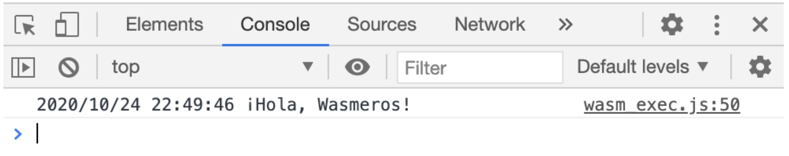
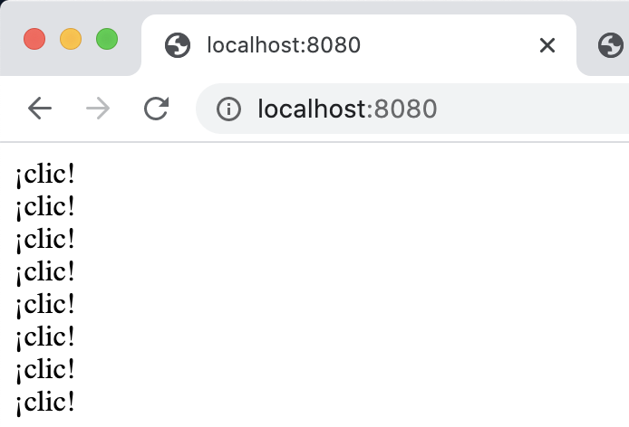

Go y WebAssembly: interactuando con la API JavaScript de tu Navegador Web
=====================================================

Por [Mario Macías Lloret](http://macias.info).

[WebAssembly (abreviado WASM)](https://webassembly.org/) promete llevar a un
siguiente nivel la programación sobre navegadores web. Hasta hace poco, los
navegadores solo eran capaces de ejecutar programas escritos en JavaScript/ECMAScript
(en adelante, nos referiremos a este lenguaje como JS).
Si se deseaba programar para el navegador en otros lenguajes, o en versiones muy
modernas de JS, era necesario un transpilador que convertía el código
a una versión de JavaScript aceptada por el navegador.

JavaScript se interpreta en tiempo de ejecución. Interpretar cadenas de texto
con el programa JS es un proceso relativamente lento, que causa que
las web se vuelvan realmente lentas a medida que se vuelven más sofisticadas.

WebAssembly, sin embargo, es una especificación de instrucciones sencillas, que
se especifican mediante código binario (como si de las instrucciones de una
CPU física se tratara). Esto no solo disminuye enormemente el tiempo de carga
(los programas a cargar son mucho más pequeños), sino que el tiempo de interpretación
y optimización del programa en tiempo de ejecución también se reduce.

Otra ventaja es que ahora es posible programar en prácticamente cualquier lenguaje
las aplicaciones que se ejecutarán directamente sobre el navegador web; incluso
en lenguajes que hasta ahora se consideraban más orientados a sistemas de bajo
nivel, como C, C++ o Rust. Esto permite llevar al navegador un gran número de
aplicaciones antiguas escritas en estos lenguajes (videojuegos, aplicaciones
multimedia...).

Sin embargo, la mayoría de bibliotecas y APIs del Navegador, imprescindibles
para interactuar con éste, siguen proporcionando interfaces JavaScript únicamente.
Este capítulo explica cómo utilizar la librería estándar para la interconexión
de Go con las APIs de JS, permitiendo instanciar objetos, invocar métodos y
funciones, acceder a sus propiedades o incluso proporcionar funciones que se
usarán como [_callback_](https://es.wikipedia.org/wiki/Callback_(inform%C3%A1tica)).

Go provee el paquete experimental `syscall/js`, que facilita la creación de
aplicaciones para el navegador web sin necesidad de ningún transpilador JS;
simplemente especificando al compilador de Go que la arquitectura de destino
será WASM. Este capítulo explicará cómo compilar de Go a WASM y cómo configurar
una aplicación web para cargar nuestros programas WASM.

## Preparando el entorno

Ejecutar un proyecto de WebAssembly en Go requiere tres archivos:

* Un archivo con extensión `.wasm`, que contiene los datos binarios de WebAssembly.
  Este archivo será generado por el compilador de Go.
* Un fichero `wasm_exec.js`, proporcionado por el equipo de Go para poder cargar
  el archivo `.wasm` dentro de la página web.
* Un fichero HTML que carga el archivo `wasm_exec.js` y lo configura para 
  cargar y ejecutar el código `.wasm` en el navegador.

Además, será necesario un servidor Web para cargar los anteriores archivos mediante
HTTP o HTTPS. Se puede utilizar cualquier servidor HTTP simple, aunque en este
capítulo crearemos nuestro servidor HTTP para probar el código de los tutoriales
sin tener que instalar ni configurar software adicional en nuestro ordenador.

## Creación del proyecto

Nuestro proyecto Go/WASM tendrá la siguiente estructura de directorios y
archivos:

```
.
├── server.go
├── site
│   ├── index.html
│   ├── main.wasm
│   └── wasm_exec.js
└── src
    └── main.go
```

* El directorio `site` contendrá los archivos mínimos indispensables para ejecutar
  un programa WASM en el navegador, tal y como se mencionó anteriormente.
* El programa `server.go` es un sencillo navegador Web de pruebas que servirá
  para cargar desde el navegador Web los archivos de la carpeta `site`.
* El directorio `src` contiene el código Go que se compilará en el archivo
  `site/main.wasm`.


## Obtención de `wasm_exec.js`

El fichero `wasm_exec.js` está disponible en la instalación estándar de Go,
bajo el directorio `${GOROOT}/misc/wasm/wasm_exec.js`. Para saber la localización
de `${GOROOT}` puede ejecutar el comando `go env GOROOT`. Por ejemplo:

```
$ go env GOROOT
/usr/local/Cellar/go/1.15.3/libexec
````

La salida anterior indicaría que el fichero `wasm_exec.js` se encuentra, en el
ordenador en que se ha ejecutado el comando, en la ruta:

```
/usr/local/Cellar/go/1.15.3/libexec/misc/wasm/wasm_exec.js 
```

Puede copiar directamente ese archivo a la carpeta `site` del proyecto. Por
ejemplo, en Linux o Mac:

```
cp "$(go env GOROOT)/misc/wasm/wasm_exec.js" ./site/
```

### 3. Crear el fichero HTML

Cree el fichero `index.html`, por ejemplo, en la carpeta `site` del proyecto.
Copie el siguiente contenido:

```html
<html>
<head>
  <meta charset="utf-8"/>
  <script src="wasm_exec.js"></script>
  <script>
    const go = new Go();
    WebAssembly.instantiateStreaming(fetch("main.wasm"), go.importObject)
        .then((result) => {
          go.run(result.instance);
        });
    </script>
</head>
<body>
</body>
</html>
```

Este archivo está vacío. Simplemente carga el fichero `wasm_exec.js`, que
a su vez cargará el fichero `main.wasm` que se creará en la siguiente
sección.

## Compilación de código Go en `main.wasm`

Como prueba, crearemos un programa de prueba muy sencillo, en la ruta
`./src/main.go` del proyecto:

```go
package main

import "log"

func main() {
    log.Println("¡Hola, Wasmeros!")
}
```

Para compilarlo, es necesario ejecutar el comando `go build`, pero con
las variables de entorno `GOOS=js` y `GOARCH=wasm` para indicar a `go build`
que el archivo generado no será un ejecutable nativo sino un archivo WASM:

```
GOOS=js GOARCH=wasm go build -o ./site/main.wasm ./src/.
```

## Ejecución del binario WASM

Por seguridad, su navegador Web no ejecutará el fichero WASM si abre el archivo
`index.hml` directamente en su navegador web. Necesitará un servidor Web que
le envíe toda la información al navegador vía HTTP o HTTPS.

No es necesario que se moleste a instalar un servidor en la máquina que usa
para programar. Por suerte, crear un servidor Web sencillo en Go es tan sencillo
como crear el fichero `server.go` en la raíz del proyecto, con el siguiente
contenido:

```go
package main

import (
	"fmt"
	"io"
	"net/http"
	"os"
	"path/filepath"
)

func main() {
    http.HandleFunc("/", func(w http.ResponseWriter, req *http.Request) {
        // por defecto, cargamos el archivo `index.html`
        if req.RequestURI == "/" {
            req.RequestURI = "/index.html"
        }
        // si no, el archivo que nos llegue por la URL lo iremos a buscar
        // a la carpeta "site"
        file, err := os.Open(filepath.Join("./site", req.RequestURI))
        if err == nil {
            // mandamos el contenido del archivo leído hacia la respuesta HTTP
            io.Copy(w, file)
        }
        // por sencillez, ignoramos cualquier gestión de errores HTTP
        // por ejemplo, si no se encuentra un archivo
    })
    // el servidor escuchará en el puerto 8080 de la máquina local
    fmt.Println(http.ListenAndServe(":8080", nil))
}
```

Las diversas funciones y elementos del programa anterior están explicadas en
en los siguientes capítulos del libro *Programación en Go*:

* Capítulo 13: Gestión de errores
* Capítulo 14: Entrada y Salida
* Capítulo 17: Servicios Web

Si ejecuta el servidor mediante `go run server.go` y abre la dirección local
`http://localhost:8080` del navegador, debería ver una ventana vacía. Pero
si abre la Consola en las herramientas de desarrollador de su navegador,
debería ver un mensaje similar al siguiente, mostrando que el archivo WASM
se ha ejecutado:



El resultado puede ser un poco decepcionante. Para permitir a nuestro programa
en Go interactuar con el documento HTML y leer/escribir contenidos en éste, 
deberemos utilizar los métodos del paquete `syscall/js`.

## Funcionalidades básicas de `syscall/js` basic functionalities

Organizaremos una ruta a través de las funcionalidades básicas de `syscall/js`
con un ejemplo sencillo que, cada vez
que se haga click en la ventana, añada una línea mostrando `¡click!` en el
documento HTML.




En Javascript, se requerirían las siguientes líneas de código:

```js
document.body.onclick = function() {
    var div = document.createElement('div');
    div.textContent = '¡clic!';
    document.body.appendChild(div);
};
```

El equivalente en Go requeriría acceder a los mismos
elementos y propiedades, pero no directamente a través del
lenguaje sino a través de diversos método de la biblioteca
`syscall/js`:


```go
 1: package main
 2: 
 3: import "syscall/js"
 4: 
 5: func main() {
 6:     window := js.Global()
 7:     doc := window.Get("document")
 8:     body := doc.Get("body")
 9:     body.Set("onclick",
10:         js.FuncOf(func(this js.Value, args []js.Value) interface{} {
11:             div := doc.Call("createElement", "div")
12:             div.Set("textContent", "¡clic!")
13:             body.Call("appendChild", div)
14:             return nil
15:         }))
16:     <-make(chan struct{})
17: }
```

La función `js.Global()` de la línea 6 retorna el objeto global. Generalmente
equivaldría a la variabla global `window` en JavaScript: el objeto raíz que
permite acceder a los demás elementos de la página. En el anterior ejemplo de
JavaScript no era necesario mencionarlo, pero en Go sí, ya que no se asume
ningún contexto por defecto.

`js.Global()` retorna un objeto del tipo `js.Value`: un estructura que puede guardar un valor de cualquier tipo de dato
de JavaScript.

El método `Get` invocado sobre cualquier `js.Value` permite
acceder a una propiedad de ese valor, retornando otro `js.Value`.
Por ejemplo, `window.Get("document")` en la línea 7 equivaldría
a invocar `window.document` en JavaScript, y `doc.Get("body")`
de la línea 8 equivaldría a invocar `document.body` en JavaScript.

Si `Get` nos permite acceder al valor de una propiedad, `Set` permite
cambiar dicho valor. El comando `div.Set("textContent", "¡clic!")` de la
línea 12 equivaldría a la línea `div.textContent = '¡clic!';` de JavaScript.
El primer comando de `Set` es un `string` con el nombre de la propiedad a
añadir o cambiar, el segundo comando puede ser un tipo de dato básico (números,
cadenas, ...) pero también puede ser otro `js.Value` o incluso una función,
que en Go se representa según el tipo `js.Func`, y se puede instanciar
mediante la función `js.FuncOf`, como se muestra en la línea 10. Las
líneas 9 y 10 del ejemplo equivalen a la orden `document.body.onclick = function() {` de JavaScript.

Para invocar métodos JavaScript, el código de ejemplo también utiliza el método `Call` de
`js.Value`. `Call` necesita, como primer argumento, el nombre de la función
o método a invocar, seguido de los argumentos que esta requiera. El ejemplo
de la línea 11 equivaldría a la invocación `document.createElement("div")` y
el de la línea 13 equivaldría a `body.appendChild(div)`. Después del
primer argumento de `Call`, que ha de ser del tipo `string`, los demás argumentos
pueden ser tipos de datos básicos, `js.Value`, o incluso otros `js.Func`.

## Para saber más

[`syscall/js` package documentation](https://golang.org/pkg/syscall/js/).
